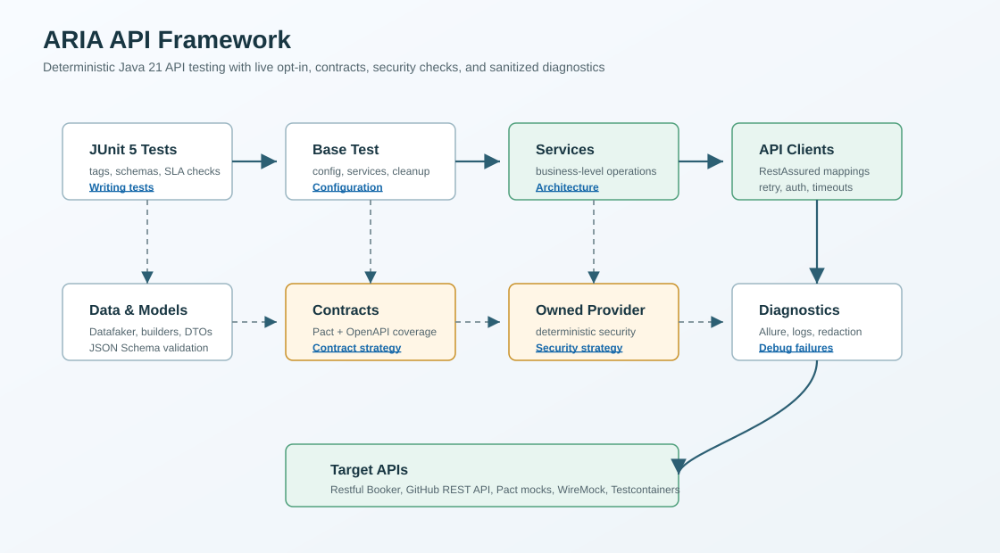

# ARIA API Framework

[](https://github.com/qa-test-automation-frameworks/aria-api-framework/actions/workflows/ci.yml)
[](LICENSE)
[](.java-version)
[](build.gradle.kts)

ARIA is the Automated REST Interface Assertion Framework: a Java 21 API test automation framework for portfolio-quality REST testing with service objects, reusable clients, generated data, schema validation, mocks, contracts, security checks, OpenAPI coverage, reporting, and CI/CD.

Allure report: [qa-test-automation-frameworks.github.io/aria-api-framework](https://qa-test-automation-frameworks.github.io/aria-api-framework/)

## Architecture

[](docs/assets/aria-framework-architecture.svg)

## Tech Stack

| Area | Tools |
| --- | --- |
| Core testing | JUnit 5, RestAssured, AssertJ |
| Mocking and contracts | WireMock 3, Pact JVM |
| Data and models | Jackson, JSON Schema Validator, Datafaker, Lombok |
| Configuration | Owner, per-environment properties |
| Containers | Docker, Docker Compose, Testcontainers |
| Reporting and logging | Allure 2, SLF4J, Logback |
| CI/CD | Jenkins, GitHub Actions |

## Prerequisites

- Java 21
- Docker Desktop
- Gradle wrapper included in the repository
- Optional GitHub PAT in `GITHUB_TOKEN` for authenticated GitHub tests

## Run Locally

```powershell
.\gradlew.bat clean test -Denv=dev
```

The default `test` task is deterministic. It excludes tests tagged `live` and runs mock, contract, config, security-boundary, and OpenAPI coverage checks that do not depend on public APIs.

Run a tag:

```powershell
.\gradlew.bat test -Denv=dev --tests "*AuthTests"
.\gradlew.bat smokeTest -Denv=dev
```

Dedicated Gradle tasks are available for common deterministic suites: `smokeTest`, `regressionTest`, `contractTest`, `securityTest`, and `containerTest`. Use `test -DincludeTags=...` only when you intentionally want raw JUnit tag filtering; live tags require explicit credentials and network access.

JUnit tags are available as `smoke`, `regression`, `negative`, `known-demo-api-limitations`, `contract`, `security`, `config`, `container`, and `live`.

Run live public API tests only when credentials and network access are intentionally available:

```powershell
$env:BOOKER_USERNAME="<restful-booker-user>"
$env:BOOKER_PASSWORD="<restful-booker-password>"
.\gradlew.bat liveTest -Denv=dev
```

Scheduled CI runs `liveSmokeTest` weekly against the configured live environment; keep broader live regression runs manual unless the target APIs are controlled. `liveSmokeTest` uses a strict `live & smoke` tag expression, so regression-only live tests are excluded from the scheduled smoke path.

Run the full quality gate used by CI:

```powershell
.\gradlew.bat clean check securityScan allureReport -Denv=dev
```

Generate OpenAPI endpoint coverage:

```powershell
.\gradlew.bat openApiCoverageReport
```

Generate Allure:

```powershell
.\gradlew.bat allureReport
```

Run with Docker:

```powershell
$env:ENV="dev"
$env:GITHUB_TOKEN="<token>"
docker compose up --build
```

## Configuration

Runtime environment files live in `src/main/resources/config`.

```properties
base.url=https://restful-booker.herokuapp.com
github.base.url=https://api.github.com
github.token=
timeout.seconds=30
retry.maxAttempts=3
retry.baseDelayMs=1000
retry.maxDelayMs=8000
retry.jitterMs=250
sla.responseTimeMs=3000
```

Sensitive values should be supplied through environment variables or system properties:

- `GITHUB_TOKEN`
- `BOOKING_BASE_URL`
- `GITHUB_BASE_URL`
- `BOOKER_USERNAME`
- `BOOKER_PASSWORD`
- `github.owner` and `github.repo` for GitHub issue write tests
- `TIMEOUT_SECONDS`
- `RETRY_MAX_ATTEMPTS`, `RETRY_BASE_DELAY_MS`, `RETRY_MAX_DELAY_MS`, and `RETRY_JITTER_MS`
- `RESPONSE_TIME_SLA_MS`

Configuration is validated at startup. Environment names must be one of `dev`, `staging`, or `prod`; base URLs must be absolute HTTP(S) URLs; timeout and retry values must be positive.
Response-time SLA thresholds are environment-configurable through `sla.responseTimeMs` or `RESPONSE_TIME_SLA_MS`.

## Quality Gates

`check` enforces:

- JUnit deterministic tests
- Spotless formatting checks
- SpotBugs static analysis for main and test code
- OpenAPI endpoint-to-test coverage generation
- CycloneDX SBOM generation in CI
- Secret-sanitized failure diagnostics and structured test logs under `build/logs`

GitHub Actions also runs dependency review, OSV scanning, Gradle wrapper validation, Docker-backed container tests, scheduled live smoke tests, and uploads Allure, SpotBugs, test-result, log, SBOM, and OpenAPI coverage artifacts.

Generate a local SBOM plus OSV scan instructions:

```powershell
.\gradlew.bat securityScan
```

If `osv-scanner` is installed, `securityScan` runs it against `build/reports/cyclonedx/bom.json` and fails on reported vulnerabilities. To fail when the scanner is missing, run:

```powershell
.\gradlew.bat securityScan -PrequireOsvScanner=true
```

## Project Structure

```text
src/main/java/com/aria/framework
  auth         Pluggable authentication strategies
  builders     Fluent request payload builders with valid defaults
  clients      RestAssured API clients
  config       Owner configuration
  models       Request and response DTOs
  services     Business-level API operations
  utils        JSON, dates, retry, and token utilities

src/test/java/com/aria/framework
  base         Shared test setup
  contracts    Pact consumer contracts
  data         Datafaker data factories
  fixtures     Owned in-memory API provider for deterministic contract/security checks
  github       GitHub REST API tests
  mocks        WireMock tests
  security     Deterministic OWASP-style API security tests
  restfulbooker Restful Booker tests
```

## Add a New API Target

1. Add base URL and credentials to `EnvironmentConfig` and environment property files.
2. Create a client under `clients` with endpoint mappings only.
3. Create a service under `services` for business-level operations.
4. Add request and response DTOs under `models`.
5. Add builders and data factories for payloads.
6. Add tests under `src/test/java` with status, header, body, response-time, and schema assertions.
7. Add the endpoint to `src/test/resources/openapi/*.yaml`.
8. Map the endpoint to tests in `src/test/resources/openapi/endpoint-test-coverage.csv`.

## Reports and Artifacts

Generated output belongs under `build/` and is intentionally ignored by version control:

- Gradle HTML/XML test reports: `build/reports/tests`
- Allure report: `build/reports/allure-report/allureReport`
- SpotBugs reports: `build/reports/spotbugs`
- OpenAPI coverage: `build/reports/openapi-coverage.md`
- Test duration summary: `build/reports/test-duration-report.md`

Do not distribute `.gradle/`, `.idea/`, or `build/` as part of the portfolio source artifact.

## Documentation

- [Audit Report](docs/AUDIT_REPORT.md)
- [Configuration Guide](docs/Configuration_Guide.md)
- [Execution Guide](docs/Execution_Guide.md)
- [Writing Tests](docs/Writing_Tests.md)
- [Debugging Test Failures](docs/Debugging_Test_Failures.md)
- [Dos and Don'ts](docs/Dos_And_Dont.md)
- [Security Test Strategy](docs/SECURITY_TEST_STRATEGY.md)
- [Architecture](docs/ARCHITECTURE.md)
- [Architecture Decision Records](docs/Adr)

## Repository Governance

- [Contributing](CONTRIBUTING.md)
- [Security Policy](SECURITY.md)
- [Code of Conduct](CODE_OF_CONDUCT.md)
- [MIT License](LICENSE)

## Troubleshooting

- Docker/Testcontainers tests require Docker Desktop or a Docker-compatible runtime. The default deterministic `test` task may show Docker-backed tests as skipped on a local machine without Docker; CI enforces that coverage through the dedicated `containerTest` gate.
- Live tests call public APIs and can fail because of network outages, rate limits, or changed public data. Keep them out of the default CI gate unless the environment is controlled.
- If live Restful Booker tests fail fast with a credential error, set `BOOKER_USERNAME` and `BOOKER_PASSWORD` or matching system properties.

## Worked Example: Add a Billing API Domain

1. Add `billing.base.url` and any credential keys to `EnvironmentConfig`, `FrameworkConfig`, and the environment property files.
2. Create `BillingApiClient` under `src/main/java/com/aria/framework/clients` with endpoint-level RestAssured mappings only.
3. Use an `AuthStrategy` implementation such as bearer token, API key, basic auth, cookie token, or OAuth2 token provider instead of hardcoding auth headers in the client.
4. Create `BillingService` under `services` for business workflows such as creating invoices or listing payments.
5. Add request and response DTOs under `models`, plus builders and data factories for valid, invalid, boundary, and security payloads.
6. Add deterministic tests against the owned provider fixture or WireMock for default CI, live tests with `@Tag("live")`, and schema assertions for both paths.
7. Expand an OpenAPI YAML file with request bodies, path/query parameters, response statuses, schemas, and security requirements.
8. Add every endpoint to `endpoint-test-coverage.csv` with default-CI and live references where applicable.
9. Add Pact consumer expectations and provider-state verification when the provider is owned or represented by an executable fixture.
