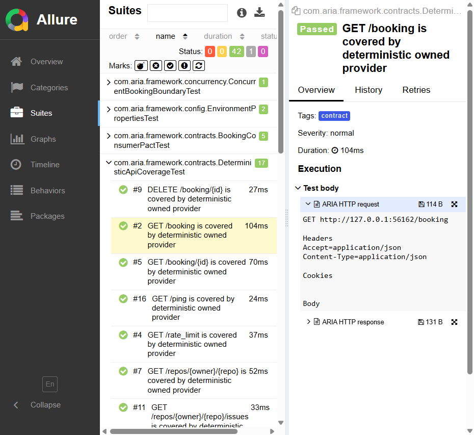

# Debugging Test Failures

ARIA is designed so most failures can be triaged from generated artifacts before rerunning locally.

## Start Here

1. Open `build/reports/tests/test/index.html` for the failing class and stack trace.
2. Open the Allure report for step-level context and sanitized HTTP attachments.
3. Check `build/logs/aria-test.log` for structured request lifecycle and retry messages.
4. Check `build/reports/openapi-coverage.md` for contract mapping failures.
5. Check `build/reports/test-duration-report.md` if the failure is timeout or SLA related.

## What ARIA Captures

| Capability | Where to look |
| --- | --- |
| Sanitized request and response exchange | Allure attachments |
| 4xx/5xx diagnostics | `ARIA HTTP diagnostic` attachment |
| Transport exceptions | Allure diagnostic attachment and logs |
| Retry behavior | `RetryUtils` warning logs |
| Contract gaps | OpenAPI coverage report |
| Public API instability | `live` test reports and `known-demo-api-limitations` tags |

## Common Failure Types

Authentication failures usually mean live credentials are missing, expired, or not visible to the Gradle process. Run `liveSmokeTest` only after setting `BOOKER_USERNAME` and `BOOKER_PASSWORD`.

Schema failures usually mean the provider response changed or the wrong schema is being asserted. Compare the Allure response body attachment with the schema under `src/test/resources/schemas`.

OpenAPI coverage failures mean a checked-in endpoint has no mapped test, a mapped test was renamed, or a response/request schema is missing.

Rate-limit failures should show retry warnings and `Retry-After` handling in logs. Deterministic 429 retry behavior is covered by `WireMockBookingTest`.

Container test skips mean Docker is not available. The default `test` task may skip local Testcontainers coverage; CI enforces it through `containerTest`.

