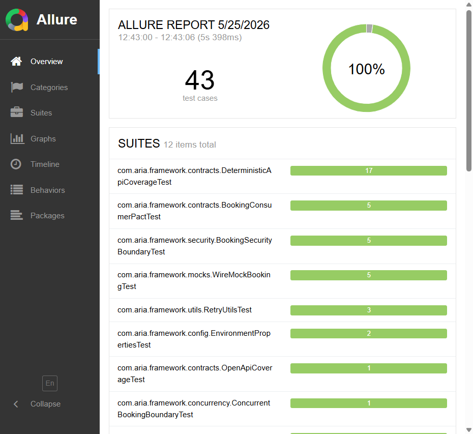

# Execution Guide

ARIA separates deterministic CI-safe tests from live public API tests.

## Local Commands

```powershell
.\gradlew.bat test -Denv=dev
.\gradlew.bat check securityScan allureReport -Denv=dev
.\gradlew.bat smokeTest -Denv=dev
.\gradlew.bat regressionTest -Denv=dev
.\gradlew.bat contractTest -Denv=dev
.\gradlew.bat securityTest -Denv=dev
```

`test` excludes `live` by default. `containerTest` requires Docker and fails if container coverage is skipped.

## Live Tests

Live tests call public APIs and require explicit credentials.

```powershell
$env:BOOKER_USERNAME="<restful-booker-user>"
$env:BOOKER_PASSWORD="<restful-booker-password>"
.\gradlew.bat liveSmokeTest -Denv=dev
```

## Reports

| Artifact | Path |
| --- | --- |
| JUnit HTML | `build/reports/tests/test/index.html` |
| Allure | `build/reports/allure-report/allureReport/index.html` |
| OpenAPI coverage | `build/reports/openapi-coverage.md` |
| Security scan | `build/reports/security-scan.md` |
| Test duration report | `build/reports/test-duration-report.md` |
| Structured logs | `build/logs/aria-test.log` |

## Allure Screenshots




