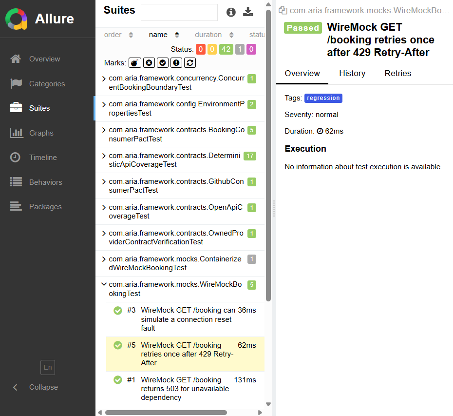

# Writing Tests

Use the framework layers instead of raw RestAssured calls in test classes.

## Standard Pattern

1. Add or reuse a payload factory in `src/test/java/com/aria/framework/data`.
2. Call a service object from the test.
3. Assert status, content type, SLA, schema, and behavior.
4. Tag the test by purpose: `smoke`, `regression`, `negative`, `contract`, `security`, `container`, or `live`.
5. Add OpenAPI coverage mapping when the test covers an endpoint contract.

## Example

```java
BookingRequest request = BookingDataFactory.validBooking();
Response response = createTrackedBooking(request);

assertThat(response.statusCode()).isEqualTo(200);
assertJsonContentType(response);
assertResponseTimeWithinConfiguredSla(response);
response.then().body(matchesJsonSchemaInClasspath("schemas/booking-schema.json"));
```

Use `BookingPayloadBuilder` for valid defaults with scenario-specific overrides. Use Datafaker only through factories so generated values stay centralized and run-scoped.

## Assertions

Prefer `assertSoftly` when a test has three or more independent assertions. Keep schema validation outside the soft assertion block because RestAssured schema failures already include path-level detail.

## Public API Limits

Some Restful Booker behaviors are intentionally documented as `known-demo-api-limitations`. Do not turn public demo weaknesses into passing security expectations; model desired behavior in the owned provider or WireMock instead.


