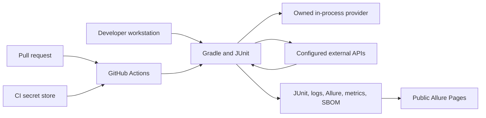

# ARIA API Framework Threat Model

## Executive Summary

ARIA runs locally and in CI, sends HTTP requests to owned fixtures and explicitly configured external APIs, and publishes sanitized test evidence. The main security risks are credential leakage into logs or public reports, untrusted target configuration, workflow or dependency compromise, excessive privileges for container execution, and treating external response content as safe diagnostic data.

The highest-priority controls are keeping secrets out of untrusted pull-request jobs, sanitizing before persistence, constraining target URLs and retry behavior, reviewing dependencies and workflow changes, and separating deterministic evidence from credentialed live execution.

## Scope and Assumptions

In scope:

- Java framework code, tests, Gradle build, GitHub Actions, Allure artifacts, and Pages deployment.
- Local and CI execution against the owned provider, Restful Booker, and GitHub API.
- Secrets provided through environment variables, system properties, or CI secret stores.

Assumptions:

- The framework is not a multi-tenant service.
- Test data is synthetic or approved for diagnostic retention.
- Published reports are public and therefore must be sanitized.
- Live target owners control authentication, availability, and rate limits.

Out of scope:

- Security of third-party APIs and GitHub's hosted infrastructure.
- Production authorization policy for systems that merely resemble test targets.

## System Model

Trust boundaries:

1. Developer or pull-request content entering the build.
2. CI secret injection into credentialed jobs.
3. HTTP traffic crossing from the runner to configured targets.
4. Untrusted response content entering logs and report attachments.
5. Generated artifacts crossing into public Pages or downloadable storage.
6. Docker/Testcontainers access to the runner's container daemon.

## Assets

| Asset | Security objective |
| --- | --- |
| API tokens, usernames, passwords, cookies | Confidentiality and minimal exposure |
| CI workflow permissions and release artifacts | Integrity |
| Test results, logs, and Allure reports | Confidentiality, integrity, useful retention |
| Target URLs and runtime configuration | Integrity |
| Dependency locks, Gradle wrapper, SBOM | Integrity and provenance |
| Owned-provider state and test data | Isolation and deterministic reset |

## Attacker Model

An attacker may submit pull-request content, alter configuration in a compromised workstation, control an external API response, publish a malicious dependency, or obtain read access to public reports. They may attempt log injection, secret exfiltration, artifact tampering, server-side request forgery through target overrides, or container-daemon abuse.

The model does not assume an attacker already has repository administrator access, write access to protected CI secrets, or control of GitHub-hosted runner infrastructure.

## Entry Points

| Entry point | Evidence anchor |
| --- | --- |
| Environment and system-property configuration | `ConfigManager` |
| HTTP request/response diagnostics | `BaseApiClient`, `FailureDiagnosticFilter`, `RedactionPolicy` |
| Credentialed authentication responses | `TokenManager`, `AuthApiClient` |
| Retryable external traffic | `RetryUtils` |
| In-process fixture routes and state | `OwnedApiProvider` |
| CI events, secrets, permissions, artifacts | `.github/workflows/ci.yml` |
| Public report deployment | `.github/workflows/deploy-allure-pages.yml` |
| Dependencies, plugins, wrapper, SBOM | `build.gradle.kts` and lockfiles |

## Abuse Paths

1. A malicious external response places a token-shaped value or terminal control content in a diagnostic field that is persisted to Allure.
2. A contributor changes a base URL override to send credentialed traffic to an unintended host.
3. Pull-request code attempts to read secrets from a credentialed workflow or upload them as artifacts.
4. A compromised dependency or action executes during the build and accesses repository contents or tokens.
5. A public Pages report exposes sensitive request data that bypassed or predated redaction.
6. Unbounded or incorrect retries duplicate a mutation or amplify traffic to a degraded API.
7. A test with container-daemon access starts a privileged workload or mounts runner data.
8. An actor tampers with generated metrics or reports and presents them as evidence from a different commit.

## Threat Register

| ID | Threat | Impact | Existing controls | Further action |
| --- | --- | --- | --- | --- |
| TM-001 | Secrets leak through logs or Allure attachments | High | Central redaction, sanitized failure filter, secret-safe policy, public-report separation | Add regression cases for encoded and nested secret shapes |
| TM-002 | Target URL override redirects credentialed traffic | High | Absolute HTTP(S) validation, explicit live credentials, deterministic default gate | Add optional host allowlists for enterprise targets |
| TM-003 | Untrusted pull-request code accesses CI secrets | Critical | Read-only default permissions; live secrets used only by scheduled job | Keep fork PRs uncredentialed and protect workflow changes with CODEOWNERS |
| TM-004 | Dependency or workflow supply-chain compromise | High | Locking, wrapper validation, dependency review, OSV, SBOM | Pin third-party actions to reviewed commit SHAs |
| TM-005 | Public report exposes sensitive test data | High | Redaction before attachment, dedicated Pages deployment after successful CI | Define artifact retention and periodically inspect published reports |
| TM-006 | Retry duplicates a mutation or hides a defect | Medium | JUnit retries disabled; mutation retries require idempotency control | Enforce policy through focused unit tests and metrics |
| TM-007 | Container test abuses runner privileges | High | Dedicated container job, no production credentials in that job | Prefer ephemeral hosted runners and avoid privileged containers |
| TM-008 | Evidence is detached from its source revision | Medium | GitHub Actions run metadata and release links | Include commit SHA and workflow URL in future metrics schema revision |

## Criticality Calibration

`Critical` means direct secret compromise or repository-control impact. `High` means likely credential, artifact, or runner compromise with a practical attack path. `Medium` means integrity or availability degradation requiring additional preconditions. This repository does not currently process regulated production data, which lowers data-classification impact but does not reduce credential exposure severity.

## Focus Paths

- **TM-001 and TM-005:** Expand `RedactionPolicy` tests whenever diagnostic formats change. Never publish raw fallback bodies.
- **TM-003:** Keep scheduled credentialed jobs separate from pull-request execution and require review for workflow changes.
- **TM-004:** Review lockfile and action changes as security-sensitive; replace action tags with immutable commit SHAs.
- **TM-002 and TM-006:** Apply host allowlists where targets are known and retain the no-test-retry policy.
- **TM-008:** Add commit identity to generated evidence before aggregating metrics across repositories.

## Residual Risk

Regex redaction cannot prove removal of every possible secret encoding. Third-party APIs and dependencies remain outside repository control. Public report publishing must therefore use synthetic data, least-privilege credentials, and periodic manual inspection in addition to automated controls.
